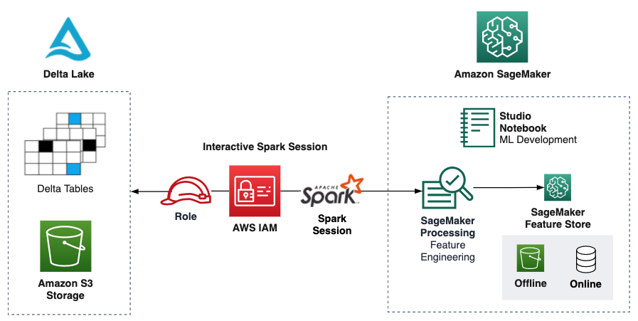

## Integrating Delta Lake tables with Amazon SageMaker

In this example, we demonstrate how to ingest and process data from [Delta Lake tables](https://delta.io/) with [Amazon SageMaker](https://aws.amazon.com/sagemaker/).

You can clone this repository in your Amazon SageMaker Studio environment, and follow these for:
* Setting up the connection with your Delta Lake table with a Python kernel, using a Spark session or Delta Sharing - Notebook [0_setup.ipynb](./notebooks/0_setup.ipynb)
* Setting up the connection with your Delta Lake table with a [Glue Interactive Sessions](https://docs.aws.amazon.com/sagemaker/latest/dg/studio-notebooks-glue.html) kernel, using a Spark session - Notebook [0_setup_GIS.ipynb](./notebooks/0_setup_GIS.ipynb)
* Performing Exploratory Data Analysis (EDA) with a Python kernel using [Interactive Data Preparation](https://docs.aws.amazon.com/sagemaker/latest/dg/data-wrangler-interactively-prepare-data-notebook.html) widget powered by SageMaker Data Wrangler - Notebook [1_notebook_eda.ipynb](./notebooks/1_notebook_eda.ipynb)
* Preparing and running a Processing job at scale with SageMaker Processing, writing to the SageMaker Feature Store - Notebook [2_feature_pipeline.ipynb](./notebooks/2_feature_pipeline.ipynb)

## Security

See [CONTRIBUTING](CONTRIBUTING.md#security-issue-notifications) for more information.

## License

This library is licensed under the MIT-0 License. See the LICENSE file.
